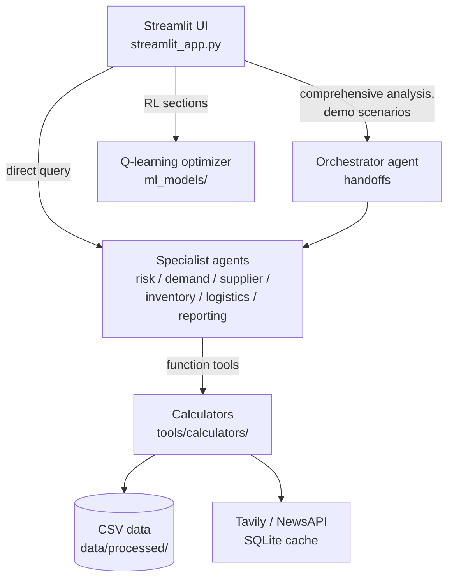

# Multi-Agent Supply Chain Analysis

This repository is a supply-chain analysis platform that puts a team of six specialist LLM agents — risk intelligence, demand forecasting, supplier assessment, inventory optimization, logistics, and executive reporting — behind a Streamlit interface, coordinated by an orchestrator agent built on the OpenAI Agents SDK. It is aimed at supply-chain analysts who want conversational analysis over their supplier, inventory, and demand data, combined with live geopolitical risk search (Tavily, NewsAPI), deterministic Python calculators for the numbers, and a tabular Q-learning model for inventory ordering that can be refined with human feedback.

## Architecture at a glance

- **Orchestration pattern: supervisor–worker via LLM-driven handoffs.** An `Orchestrator` agent (`supply_chain_agents/orchestrator.py`) declares the six specialists as `handoffs`; the model decides which specialist receives control for a given query. Each specialist is itself a **single-agent tool loop**: an OpenAI Agents SDK `Agent` whose tools are plain Python functions (calculators and API clients) exposed through a reflection-based `FunctionTool` wrapper (`utils/tool_helpers.py`). Most Streamlit sections skip the orchestrator and call the relevant specialist directly; the orchestrator handles the "Comprehensive Analysis" and "Demo Scenarios" flows.
- **Execution model:** each request is one synchronous `Runner.run(...)` on a fresh event loop per Streamlit interaction. There is no application-level parallel fan-out; handoffs transfer control sequentially. See [docs/ARCHITECTURE.md](docs/ARCHITECTURE.md) for the full analysis.
- **Model/framework:** `openai-agents` (OpenAI Agents SDK) with the SDK's default OpenAI model — no model is pinned in code.
- **Memory/state:** no conversation memory is persisted (`session=None` on every run). Streamlit `session_state` holds in-browser feedback history; a SQLite cache (`tools/data_sources/cache_manager.py`, 1-hour TTL) memoizes external API responses; Q-learning tables are pickled per product under `ml_models/rl_models/`.
- **Retrieval:** live web search through Tavily and NewsAPI plus pandas lookups over local CSVs (`data/processed/`). There is no vector store or embedding-based retrieval in this codebase.



## Quickstart

```bash
git clone https://github.com/git-bonda108/supply-chain-agents.git
cd supply-chain-agents

python -m venv .venv
source .venv/bin/activate        # Windows: .venv\Scripts\activate
pip install -r requirements.txt

# Create .env with your own keys (placeholders shown — never commit real values)
cat > .env <<'EOF'
OPENAI_API_KEY=your_openai_api_key
TAVILY_API_KEY=your_tavily_api_key
NEWSAPI_KEY=your_newsapi_key
EOF

# Web UI
streamlit run streamlit_app.py
```

Expected output from Streamlit: `You can now view your Streamlit app in your browser.` with a local URL, `http://localhost:8501`. On first use, mock supplier/inventory/demand CSVs are generated automatically under `data/processed/` if none exist.

CLI alternative:

```bash
python main.py
```

Expected output: a banner (`Supply Chain AI Demo - Multi-Agent System`), a per-key validation checklist, `✅ Data infrastructure ready`, then a prompt — `Enter your supply chain query (or 'demo' for example):` — and the orchestrator's answer.

Scripted demo scenarios:

```bash
python run_demo.py                      # lists scenario ids
python run_demo.py memory_chip_shortage # runs one scenario through the orchestrator
```

## Configuration

All configuration is via environment variables (loaded from `.env` by `python-dotenv`).

| Variable | Required | Default | What it is / where to get it |
|----------|----------|---------|------------------------------|
| `OPENAI_API_KEY` | Yes | — | Powers all agents (OpenAI Agents SDK). [platform.openai.com](https://platform.openai.com/api-keys) |
| `TAVILY_API_KEY` | Yes | — | Real-time geopolitical/export-control search. [tavily.com](https://tavily.com) |
| `NEWSAPI_KEY` | Yes | — | Supply-chain news aggregation. [newsapi.org](https://newsapi.org) |
| `ANTHROPIC_API_KEY` | No | — | Checked for presence by `utils/helpers.py` only; no code path consumes it |
| `DEEPSEEK_API_KEY` | No | — | Same — presence check only |
| `GROQ_API_KEY` | No | — | Same — presence check only |
| `GEMINI_API_KEY` | No | — | Same — presence check only |
| `SERPER_API_KEY` | No | — | Same — presence check only |
| `LOG_LEVEL` | No | `INFO` | Python logging level |
| `CACHE_TTL_SECONDS` | No | `3600` | TTL for the SQLite API-response cache |
| `ENABLE_CACHE` | No | `true` | Toggle the API-response cache |
| `TAVILY_RATE_LIMIT` | No | `100` | Read into the client; the enforced limit is the hardcoded 100 calls/min decorator |
| `NEWSAPI_RATE_LIMIT` | No | `100` | Same — decorator enforces the fixed 100 calls/min |

## Documentation

- [docs/ARCHITECTURE.md](docs/ARCHITECTURE.md) — component map, data flow, orchestration and state analysis, design trade-offs
- [docs/EVALUATION.md](docs/EVALUATION.md) — what is actually tested, how to run it, and a proposed evaluation harness
- [docs/HARDENING.md](docs/HARDENING.md) — current security posture and a staged path to production

Earlier working notes from the original build (`SOLUTION_OVERVIEW.md`, `IMPLEMENTATION_GUIDE.md`, `STREAMLIT_GUIDE.md`, and similar files at the repository root) are retained as historical records; the three documents above are the maintained reference.

## Repository layout

```
supply_chain_agents/   Orchestrator + 6 specialist agent definitions
config/                Per-agent instruction prompts
tools/calculators/     Deterministic analysis functions used as agent tools
tools/data_sources/    Tavily/NewsAPI clients, SQLite cache, background refresher
tools/                 Data loader, uploader/validator, mock data generator, report generator
ml_models/             Tabular Q-learning inventory optimizer + human-feedback rewards
utils/                 Tool-wrapper factory, env validation, error-handling helpers
demo/                  Scripted scenarios and runner
tests/, test_*.py      Component, integration, and end-to-end test scripts
streamlit_app.py       Web UI (primary entry point)
main.py                CLI entry point
```
